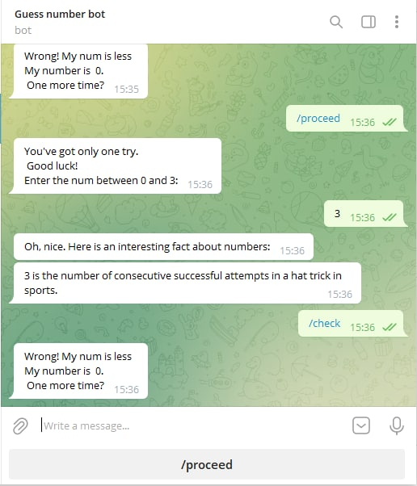
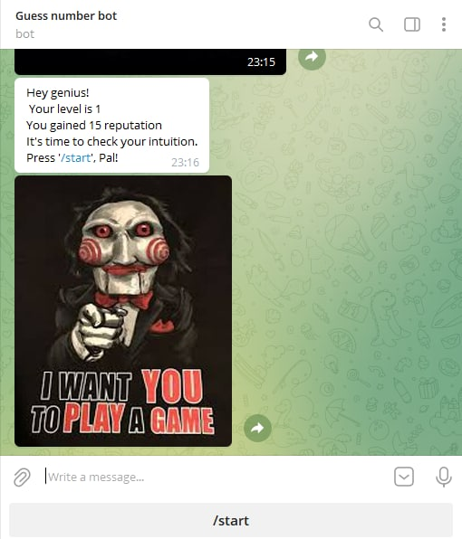

# Guess number bot
Для психически стабильных людей 
# Краткое описание
Игра, в которой предстоит угадывать число.
Бот, который позволяет тратить время впустую,
всего 1 шанс угадать число от 0 до 3 на начальном уровне.
Чем выше уровень - тем шансы сохранить психическую
стабильность становятся ниже.
Также сообщает какой-то случайный интересный факт о числе, либо 
приводит его запись в двоичной системе исчисления.
# Технологии
Использован python-telegram-bot
## Краткое руководство

 - Для начала игры нажми /start
 - Для следующего шага /proceed
 - Введи число из заданного диапазона и проверяй, если уверен, либо сдавайся.
 - Если угадал число - получаешь репутацию и повышаешь уровень.
 - Не угадал - можешь попробовать ещё раз.
 - При повышении уровня - диапазон увеличивается, а значит шансов всё меньше.
# ФОТО
 ###Логотип

###Бот присылает интересный факт о твоем числе

###Можно посмотреть свой уровень и репутацию

